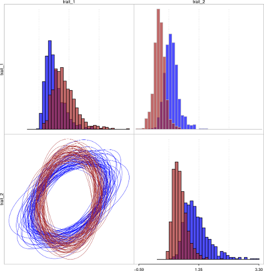

## R package 'ratematrix'

*Daniel S. Caetano and Luke J. Harmon*

R package for the study of patterns of evolutionary correlation among two or more traits using phylogenetic trees. 'ratematrix' offers a suite of tools to estimate the evolutionary rate matrix (R) incorporating uncertainty in the form of a posterior distribution using Markov-chain Monte Carlo. The package allows for quick set-up and run of MCMC chain while also providing tools for users to customize their own MCMC chains.

For more information on the kind of models implemented here, please refer to "Revell, L. J., and L. J. Harmon. 2008. Testing quantitative genetic hypotheses about the evolutionary rate matrix for continuous characters. Evolutionary Ecology Research 10:311." and "Revell, L. J., and D. C. Collar. 2009. Phylogenetic Analysis of the Evolutionary Correlation Using Likelihood. Evolution 63:1090–1100.".

This package is under development. Although most of the functionality is already working without any problems, please contact the author (caetanods1[at]gmail.com) if you are interested in using this package for any publication.

Here is a quick example of how to run a MCMC chain. Please check the wiki page for a comprehensive tutorial. You will need the package 'devtools' to perform the installation.
```
install.packages("devtools")
library(devtools)
install_github("Caetanods/ratematrix")
```

Short tutorial to show the usage of the package:
```
##
```



Figure shows the posterior distribution of rates in the diagonal and posterior distribution of covariated evolution in the upper right. Lower left plot show an ellipse that describes the covariation structure. The vertical red lines and the red ellipse lines are the true values used to simulated data.
