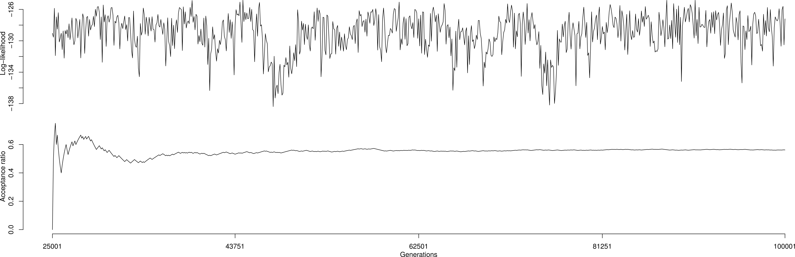

## R package 'ratematrix'

*Daniel S. Caetano and Luke J. Harmon*

R package for the study of patterns of evolutionary correlation among two or more traits using phylogenetic trees. 'ratematrix' offers a suite of tools to estimate the evolutionary rate matrix (R) incorporating uncertainty in the form of a posterior distribution using Markov-chain Monte Carlo. The package allows for quick set-up and run of MCMC chain while also providing tools for users to customize their own MCMC chains.

For more information on the kind of models implemented here, please refer to "Revell, L. J., and L. J. Harmon. 2008. Testing quantitative genetic hypotheses about the evolutionary rate matrix for continuous characters. Evolutionary Ecology Research 10:311." and "Revell, L. J., and D. C. Collar. 2009. Phylogenetic Analysis of the Evolutionary Correlation Using Likelihood. Evolution 63:1090–1100.".

This package is under development. Although most of the functionality is already working without any problems, please contact the author (caetanods1[at]gmail.com) if you are interested in using this package for any publication.

Here is a quick example of how to run a MCMC chain. Please check the wiki page for a comprehensive tutorial. You will need the package 'devtools' to perform the installation.
```
install.packages("devtools")
library(devtools)
install_github("Caetanods/ratematrix")
```

Short tutorial to show the usage of the package:
```
## Load packages.
library( ratematrix )
library( phytools )

## Simulate a phylogenetic tree.
phy <- pbtree(n=50)

## Create two regimes and fit the regimes to the phylogeny using stochastic mapping.
state <- rep(c("marine","terrestrial"), each=25)
names(state) <- phy$tip.label
phy.map <- make.simmap(tree=phy, x=state, model="ARD")
cols <- setNames(c("blue","brown"), c("marine","terrestrial"))
plotSimmap(phy.map, colors=cols)

## Simulate two traits. The traits are more correlated in the marine species.
sea.rate <- rbind( c(1,0.5), c(0.5,1) )
land.rate <- rbind( c(1,0.1), c(0.1,1) )
rates <- list(sea.rate, land.rate)
names(rates) <- c("marine","terrestrial")
data <- sim.corrs(tree=phy.map, vcv=rates, anc=c(2,5) )

## Set up and run a MCMC chain.
## First check an estimate of the time the MCMC chain will take to run:
estimateTimeMCMC(data=data, phy=phy.map, gen=100000)

## Note that this step will write files to the current working directory.
## You can change the path to another directory using the 'dir' option.
## If 'dir' is NULL, files will be written to the current directory.
handle <- ratematrixMCMC(data=data, phy=phy.map, gen=100000, dir=NULL)

## Now we can load the MCMC samples and make some plots:
posterior <- readMCMC(handle, burn=0.25, thin=100)
logAnalizer(handle, burn=0.25, thin=100)
plotRatematrix(posterior, colors=c("blue","brown"), , alphaDiag=0.7, alphaOff=0.7)
plotRootValue(posterior)

## A quick check of how good the posterior is compared to the true values:
plotRatematrix(posterior, colors=c("blue","brown"), alphaDiag=0.7, alphaOff=0.7, point.matrix=rates, point.color=c("green","green"), point.wd=3)
```
\
\
\

\
\
Figure shows the trace plot for the log-likelihood of the model and the acceptance ratio. Note that first few generations of the acceptance ratio trace plot suffer from a smaller sample size and, as a result, behave in a strange manner.
\
\
\

\
\
Figure shows the posterior distribution of rates of evolution for each trait in the diagonal histograms. Upper-diagonal histograms are the posterior distribution for the pairwise covariated evolution among traits. Lower-diagonal plots show ellipses with the bivariate distribution among traits.